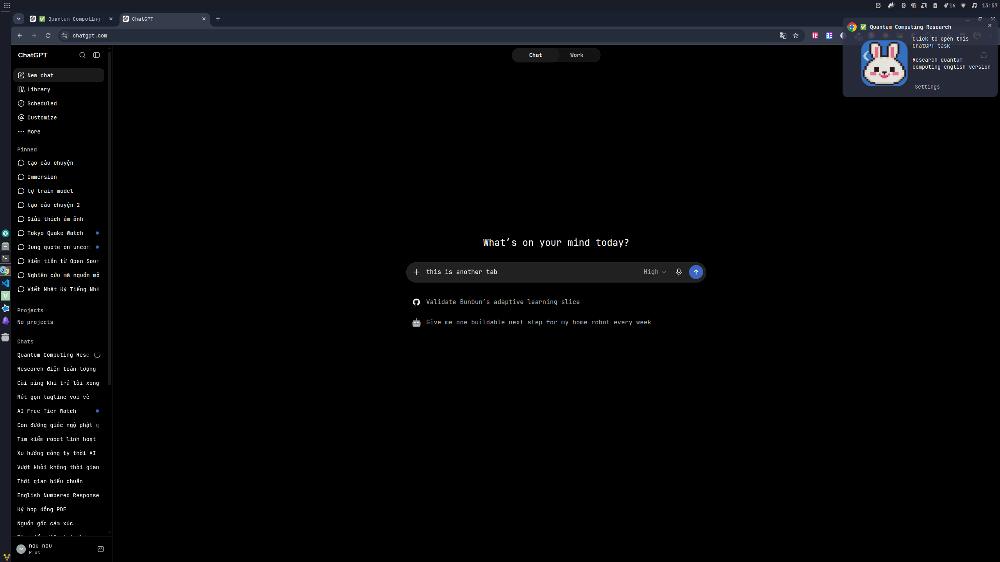
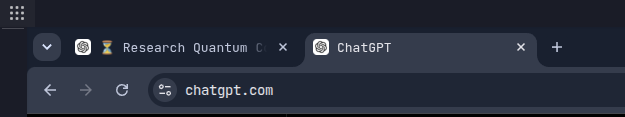
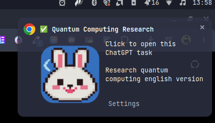
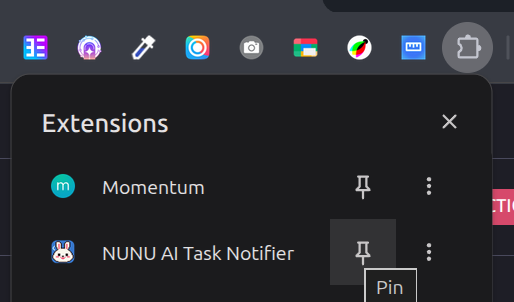
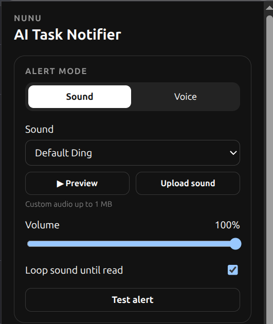
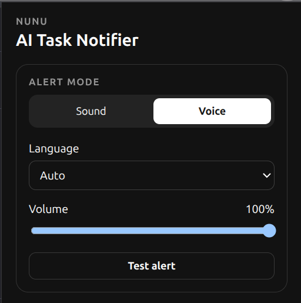

# 🔔 NUNU AI Task Notifier

**ChatGPT 好了？NUNU 提醒你。🔔**

发任务，切走。完成后，NUNU 叫你回来。

[English](README.md) · [Tiếng Việt](README.vi.md) · [日本語](README.ja.md) · [한국어](README.ko.md) · [中文](README.zh-CN.md)

> 独立开源扩展。不是 OpenAI 官方产品。

<table align="center">
<tr>
<td align="center">

</td>
</tr>
</table>

<table align="center">
<tr>
<td align="center">
<a href="https://chromewebstore.google.com/detail/nunu-ai-task-notifier/kkejgnpiempejoladofoaaaifahfcjcl">

</a>
</td>
</tr>
</table>

## 怎么用？

1. 发送 Prompt。
2. 去忙别的。
3. `⏳` 运行中。
4. `✅` 完成。
5. 点击 → 回到 task。

```text
Prompt → ⏳ → 忙别的 → ✅ → 点击
```

<table align="center">
<tr>
<td align="center" width="33%">
<br>
<sub><b>1. `⏳` 运行中</b><br>标签页图标变了，放心去忙别的</sub>
</td>
<td align="center" width="33%">
<br>
<sub><b>2. `✅` 完成</b><br>图标变化，提醒你任务已完成</sub>
</td>
<td align="center" width="33%">
<br>
<sub><b>3. 🔔 点击 → 返回</b><br>点击通知即可跳转到对应标签页</sub>
</td>
</tr>
</table>

## 为什么？

因为每 10 秒看一次 ChatGPT 很累。

NUNU 帮你盯着。

## Features

- `⏳` 运行中
- `✅` 完成 / 未读
- 🔔 Desktop 通知
- 🔊 Sound 通知
- 🗣️ Voice 通知
- 📥 Multi-tab Task Inbox
- 🔢 未读 Badge
- 🧹 合并接近的提醒
- 🌏 Auto language: EN / VI / JA / KO / ZH
- 💾 Reload 后仍保留 task state

## Install

### Chrome 应用商店（推荐）

[安装 NUNU AI Task Notifier →](https://chromewebstore.google.com/detail/nunu-ai-task-notifier/kkejgnpiempejoladofoaaaifahfcjcl)

安装后，将 NUNU 固定到工具栏，方便随时打开：

<table width="640">
<tr>
<th align="center" width="50%">1. 固定扩展</th>
<th align="center" width="50%">2. 从工具栏打开 NUNU</th>
</tr>
<tr>
<td align="center" valign="middle" width="50%">

</td>
<td align="center" valign="middle" width="50%">

</td>
</tr>
<tr>
<td align="center" valign="top">
<sub>点击<b>拼图图标</b> → NUNU 旁的<b>固定</b>。</sub>
</td>
<td align="center" valign="top">
<sub>点击 <b>NUNU</b> 图标打开设置。</sub>
</td>
</tr>
</table>

弹出窗口中的设置界面：

<table>
<tr>
<td align="left" valign="top" width="50%">

</td>
<td align="left" valign="top" width="50%">

</td>
</tr>
<tr>
<td align="left" valign="top">
<sub><b>Sound</b> — 选择提示音、音量和循环播放</sub>
</td>
<td align="left" valign="top">
<sub><b>Voice</b> — 选择朗读语言和音量</sub>
</td>
</tr>
</table>

<details>
<summary><b>从源码安装（开发者）</b></summary>

1. Clone/download repo。
2. 打开 `chrome://extensions`。
3. 开启 **Developer mode**。
4. 点击 **Load unpacked**。
5. 选择包含 `manifest.json` 的 folder。
6. Pin NUNU。
7. 打开 `https://chatgpt.com`。

搞定。🎉

</details>

## Sound

NUNU → **Sound**

选提示音、Preview、调 volume、loop 或上传 custom audio。

## Voice

NUNU → **Voice**

选择语言或 **Auto**。  
Voice 取决于 browser/OS。

## 已经在那个 tab？

NUNU 不打扰。

Background task？Ping. 🔔

## 多个 task？

当然。

每个 ChatGPT tab 单独跟踪。  
一起完成 → 提醒一起发。

## Privacy

Local-first:

- 不需要 NUNU account
- 没有 NUNU backend
- 无广告
- 默认无 analytics
- 不出售 user data
- settings 保存在 Chrome local storage
- access 仅限 `https://chatgpt.com/*`

Voice 使用 browser/OS speech synthesis。部分 voice 可能依赖网络。

详情：[PRIVACY.md](PRIVACY.md)

## Permissions

只要需要的权限：

- `notifications` — 完成提醒
- `storage` — settings + task state
- `webRequest` — 检测 request 完成
- `offscreen` — background sound/voice
- `scripting` — 恢复 integration
- `https://chatgpt.com/*` — ChatGPT only

NUNU 不会 block 或 modify ChatGPT request。

## Contributing

Bug、翻译、PR 都欢迎。

[CONTRIBUTING.md](CONTRIBUTING.md)

## License

Source code: MIT.

Third-party audio 可能使用单独 license。  
[LICENSE](LICENSE) / [THIRD_PARTY_NOTICES.md](THIRD_PARTY_NOTICES.md)
